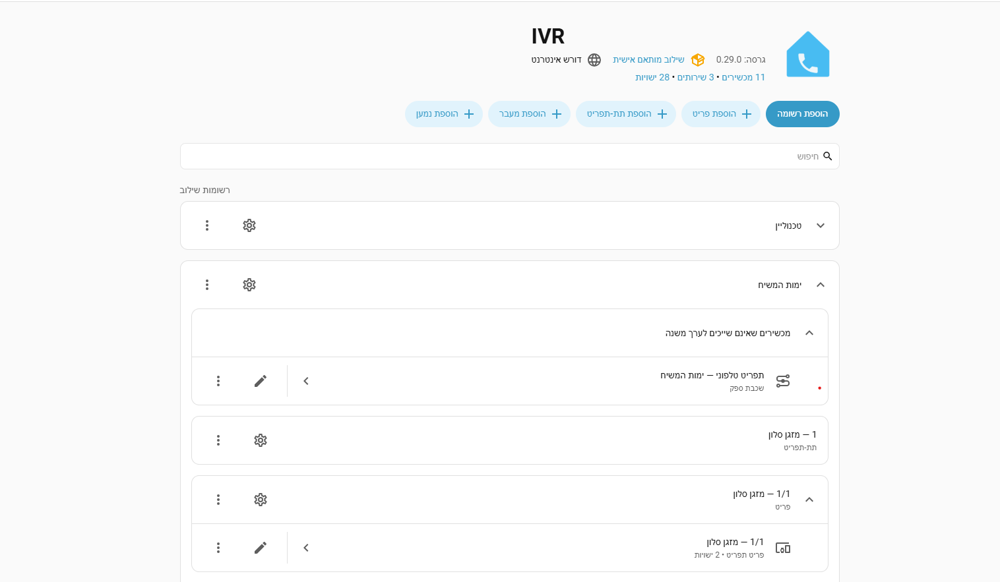
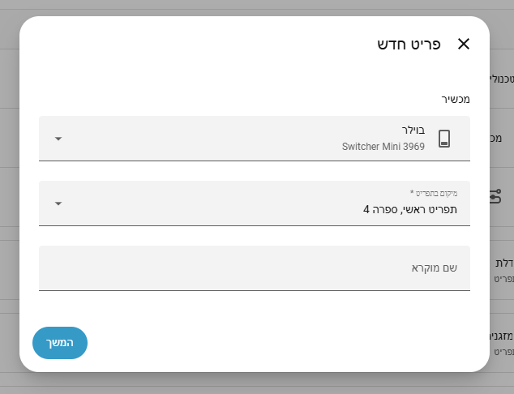
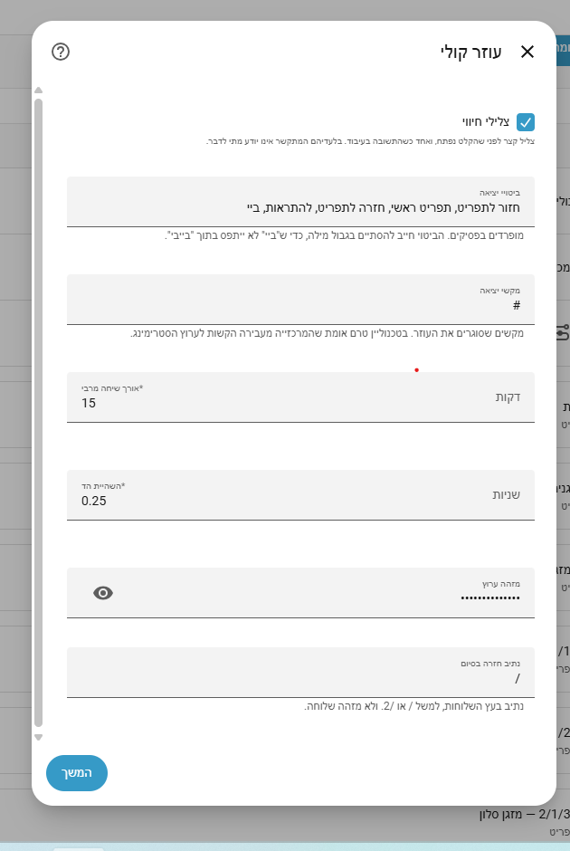

# IVR — Phone Menu and Voice Assistant for Home Assistant

[](https://hacs.xyz)
[](https://github.com/meni123/ha-ivr/actions/workflows/validate.yml)
[](https://www.home-assistant.io)
[](LICENSE)

> **עברית:** [README.md](README.md)

Call your house from any phone. Press a key to turn on a light or
hear the water heater's state — or just **talk** to Home Assistant
in a real conversation. And get voice alerts back: the house calls
you and reads out what happened.

No internet on the phone, no app, no VPN.

---

## What you get, by provider

| | Yemot HaMashiach | Technoline | Vonage |
|---|:---:|:---:|:---:|
| **DTMF menu** — a keypress acts and speaks | ✅ | ✅ | ✅ |
| **Voice assistant** — free conversation with Assist | ❌ | ✅ | ✅ |
| **Voice alerts** — the house dials you | ✅ | ✅ | ❌ |

The gaps are not missing work — they are what each provider offers.
Yemot has no streaming channel, so there is no way to carry a live
conversation. Vonage's outbound path is not implemented yet.

**Several providers can run side by side.** Each gets its own card,
with a separate menu tree, token and entities.

---

## What it looks like

<p align="center">
  
</p>

The menu is built from the UI. Pick an entity and a position in the
tree; the next screen picks the action:

<p align="center">
  
</p>

---

## Prerequisites

| Requirement | Detail |
|---|---|
| Home Assistant | 2024.6 or newer |
| External HTTPS address | The provider calls **into** your server. Cloudflare tunnel, Nginx, DuckDNS — any solution |
| TLS | Mandatory. The token travels inside the URL |
| A provider account | Yemot HaMashiach, Technoline or Vonage |
| Voice assistant only | A configured Assist pipeline with speech-to-text and text-to-speech |

---

## Installation — five steps

### Step 1 · Install the integration

**Via HACS (recommended)**

1. In HACS, three-dot menu → `Custom repositories`
2. Paste `https://github.com/meni123/ha-ivr`, category `Integration`, click `Add`
3. Search for `IVR` and install
4. **Restart Home Assistant** — a full restart, not a config reload

**Manually**

Copy the `custom_components/ha_ivr/` directory **in full**, including
`translations/` and `brand/`, into `config/custom_components/`, and
restart.

---

### Step 2 · Configure the reverse proxy — mandatory

Your server is not directly on the internet but behind a gateway.
Without this, Home Assistant sees the gateway's address instead of
the provider's, **and blocks the provider itself.** The symptom is a
call that drops with no log line at all.

**As of 2026.8** this moved into the UI:

*Settings → System → Network → HTTP server*

Enable **Trust X-Forwarded-For** and add `127.0.0.1` and `::1` to the
proxy list. The two entries are the same local address in two
notations, and both are required. If the gateway runs on another
machine, add its address.

Upgrading to 2026.8 imports an existing `http:` block into the UI
automatically, and raises a repair issue asking you to remove it from
`configuration.yaml`.

**On older versions** — in `configuration.yaml`:

```yaml
http:
  use_x_forwarded_for: true
  trusted_proxies:
    - 127.0.0.1
    - ::1
```

---

### Step 3 · Connect the provider

*Settings → Devices & Services → Add Integration → **IVR***

The first step asks **which provider**. Everything after it shows
only that provider's fields — choosing Yemot will not show
Technoline fields, and will not show a "Voice assistant" screen,
because it has no streaming channel.

| Field | Meaning |
|---|---|
| Provider IP ranges | Who may call in. Defaults to the selected provider's range |
| Allowed phone numbers | Who may call. Optional, **and strongly recommended** |
| Intro sentence | What is heard when entering the menu |
| Credential field | Management token (Yemot) or API key (Technoline) — needed for alerts only |

---

### Step 4 · Configure the extension at the provider

The entry's options screen shows the exact URL to copy. It is the
only place in the UI that displays it:

```
https://<your-address>/api/ha_ivr/<provider>/<token>
```

#### Yemot HaMashiach

An `api` extension, containing:

```ini
type=api
api_link=https://<your-address>/api/ha_ivr/yemot/<token>
api_url_post=yes
api_wait_answer_music_on_hold=yes
api_end_goto=hangup
```

| Field | Why it is needed |
|---|---|
| `api_link` | The URL from the screen. **The token is part of the path** |
| `api_url_post` | Parameters arrive in the request body |
| `api_wait_answer_music_on_hold` | Without it the caller hears total silence while the action runs, and assumes the line dropped |
| `api_end_goto` | Covers a response that does not say where to continue. Yemot's default is to go one level back |

#### Technoline

**Two extensions** — one for the menu, one for the voice assistant:

1. **An `api` extension** — paste the URL from the screen. This is the
   menu. Enable **all keys** on it: a restricted list makes the
   exchange swallow any key not on it, and the press never arrives.

2. **A `stream` extension** — for the voice assistant only. Paste the
   `wss` URL from the screen, **and add an `Authorization` header**
   with the value:

   ```
   Bearer <token>
   ```

   The same token as in the URL. **Without this header the connection
   is rejected with 401** and the assistant will not answer.

#### Vonage

In the application's Answer URL — the URL from the screen. **Nothing
to configure for streaming**: the channel address and the
authorization header are sent automatically inside the NCCO during
the call.

Make sure the Event URL does **not** point at the same address as the
Answer URL, or every status event will be treated as a new call.

---

### Step 5 · Build the menu

On the integration card, the `+` button offers four types:

| Type | What it does |
|---|---|
| **Menu item** | A key that acts on an entity, or just reads its state |
| **Submenu** | A key that opens another level. Nests up to four levels |
| **Go to extension** | Hands the call to another extension at the provider — the voice assistant, for example |
| **Alert recipient** | A phone number that becomes a `notify` entity |

The path is the key sequence: `1` is key 1 at the root, `1/2` is key
2 inside key 1's submenu. `*` goes one level back.

**The tree is rebuilt on every call**, so a change in the form
affects the next call — with no restart.

---

## The voice assistant

<p align="center">
  
</p>

A WebSocket channel streams two-way audio into the Assist pipeline.
A free conversation over the phone, including device control,
barge-in mid-sentence, and an exit phrase that returns to the menu.

It runs as an `assist_satellite` entity — the same platform Home
Assistant's own VoIP integration uses.

**The pipeline and VAD sensitivity are `select` entities on the
device, not form fields.** This is not a style choice: Home
Assistant reads both from the entity registry, and a value set
anywhere else simply never reaches the pipeline.

**Two lines per entry.** A second concurrent call lands on the
second line; a third is rejected with a tone, rather than a socket
that closes in silence.

---

## Voice alerts

Every recipient is a separate `notify` entity, so an automation
picks people exactly the way it picks any other entity:

```yaml
automation:
  - alias: front_door_alert
    triggers:
      - trigger: state
        entity_id: binary_sensor.front_door
        to: "on"
    actions:
      - action: notify.send_message
        target:
          entity_id: notify.dad
        data:
          message: The front door was opened
```

For a number computed at runtime — from a template, from `person`,
or from anywhere else — `ha_ivr.send_call` takes an explicit list.

Every incoming call also fires the `ha_ivr_call_received` event,
carrying the path, the entity and the caller. An automation can run
on the call itself.

**On Technoline the speech is generated in Home Assistant**, not at
the provider: the outbound call only dials and connects the
recipient to the streaming channel. That is also what works around
their speech engine, which fails on some accounts.

---

## Security

**This integration opens an internet-facing endpoint that can
physically control your home, including blinds and locks.** Read
this section before enabling it.

### What is built in

- Filtering by the real connection address, resistant to header spoofing
- A strong random token, compared in constant time against timing attacks
- `Bearer` authentication required on the streaming channel from every
  provider — configured on the extension for Technoline, sent
  automatically in the NCCO for Vonage
- The token identifies the **entry** — a request for one provider is never resolved against another's token
- An action allow-list, checked before any other stage
- Caller-number filtering — the strongest layer available
- A line cap and a call-length cap, as a ceiling against abuse
- Secrets redacted in the log, the history buffer and the diagnostics file

### The token is a password

It is embedded in the URL configured at the provider. **Never publish
it** — not in forums, support groups, screenshots or bug reports. On
any suspicion of a leak, replace the token in the options screen and
update it at the provider.

### Risks worth knowing

| Risk | Recommendation |
|---|---|
| Control of locks and gates | Fill in the allowed phone numbers field |
| **Telephony costs** | Every inbound and outbound call costs money at the provider |
| **Voice assistant costs** | Every call consumes speech-to-text, a language model and text-to-speech — usually billed per use |
| A leaked token | Whoever holds it can open calls and burn budget, without touching the house |
| Disabling address filtering | For diagnosis only, and briefly |
| Running without TLS | The token travels in clear text |
| An over-broad proxy list | List only the gateways you run yourself |

### Enabling automatic banning

A built-in Home Assistant mechanism, off by default:

```yaml
http:
  ip_ban_enabled: true
  login_attempts_threshold: 10
```

Note that repeatedly mistyping your own password may lock you out.
Recovery requires editing the ban file and restarting.

---

## Troubleshooting

**A request that arrived always produces a log line, even when it is
rejected.** So a completely empty log means the request **never
arrived** — the problem is at the provider or in the URL, not here.

| Symptom | Likely cause |
|---|---|
| Call drops immediately, **zero log lines** | The URL at the provider is wrong or from an older version |
| `Blocked a request from…` in the log | The reverse proxy setup (step 2) is missing, or the range is wrong |
| `Bad token` / `401` in the log | The token in the provider's URL does not match. Copy it again |
| `503 Not configured` in the log | No entry is configured for that provider |
| An undefined key gives total silence | The exchange restricts which keys are forwarded. Allow all of them |
| The UI shows English | The `translations` directory was not copied, or a full restart is needed |
| The voice assistant does not answer | On Technoline: the `stream` extension is missing, or its `Authorization` header is not set |
| Alerts fail | Check your unit balance at the provider — that is the common cause |

For detailed diagnosis:

```yaml
logger:
  logs:
    custom_components.ha_ivr: debug
```

The integration card also offers **Download diagnostics** — a single
file with the configuration (without secrets), the menu tree as it
is actually built, and the last exchanges with the provider. That is
what to attach to a bug report.

---

## Known limitations

This project was built against measurement on real calls, not
against documentation. Anything unverified is marked as such, here
and in `CHANGELOG.md`:

- **Fields 7–10 of Yemot's `read`** — the mapping is unconfirmed, and
  the code deliberately does not guess it
- **Vonage has no outbound path**, so it has no recipient entities
- **VAD sometimes misses the start of speech** — investigated, not solved

---

## Disclaimer

**This software is provided as is, without warranty of any kind. Use
of it is entirely and solely at the user's own risk.**

The developer bears no liability whatsoever, direct or indirect, for
any damage, loss, breach, unauthorised access, malfunction, incorrect
operation of devices, monetary charge, or any other consequence
arising from installing this software, using it, or being unable to
use it.

In particular, and without limiting the above:

- This software opens an internet-facing endpoint that controls
  physical devices. **Assessing that risk and deciding to install is
  the user's responsibility alone**
- The security measures are intended to reduce risk, and do not
  guarantee absolute protection against unauthorised access
- Integration with locks, gates or alarm systems is done at the
  user's own risk alone
- **All costs are the user's responsibility** — inbound and outbound
  calls at the telephony provider, as well as speech-to-text, language
  model and text-to-speech usage in the voice assistant, which are
  typically billed per use
- The user is responsible for securing their server, keeping the
  token secret, and configuring their gateway
- **This is not an official Home Assistant product**, is not
  developed, supported or endorsed by the Open Home Foundation or
  Nabu Casa, and the developer is not affiliated with them. It is a
  third-party custom integration
- **This is not an official product of Yemot HaMashiach, Technoline
  or Vonage**, is not supported or endorsed by them, and the
  developer is not affiliated with any of them
- The user is responsible for complying with their chosen provider's
  terms of service

**Installing and using this software constitutes full agreement to
these terms.**

---

## Development

```bash
python3 tests/run_live.py     # 350 checks, without Home Assistant
python3 tests/check_names.py  # a name used before it is defined
python3 tests/check_flow.py   # use before assignment
python3 tests/check_gate.py   # every exit path reopens the input gate
```

The tests import the real modules against a fake Home Assistant, so a
changed signature or a missing import fails here rather than on a
call. Some of them enforce architectural rules: the core may not name
a provider, every user-facing error carries a translation key, and no
real phone number or personal path enters the tree.

**Adding a provider** is a new module under `providers/` and one line
in `PROVIDERS`. A test fails if anything more than that is needed.

---

## Predecessor

This project succeeds [`ha-yemot`](https://github.com/meni123/ha-yemot),
which supported Yemot alone. Both can be installed side by side —
just not on the same extension.

## License

[MIT](LICENSE), including its standard warranty disclaimer.
